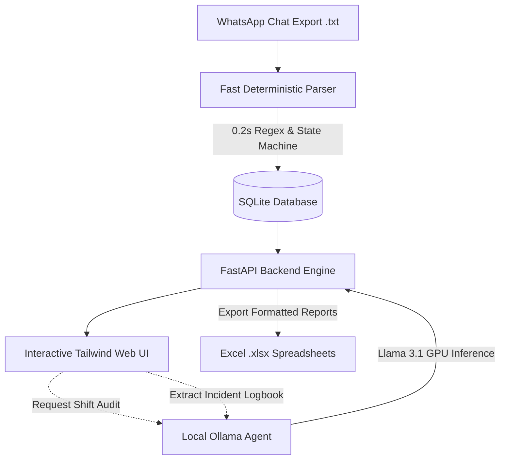

# 🛡️ Patrol Manager AI - Automated Shift Auditor & Incident Logbook

[](https://python.org)
[](https://fastapi.tiangolo.com)
[](https://www.docker.com/)
[](https://tailwindcss.com/)
[](https://www.sqlite.org/)
[-FF6F00?style=for-the-badge)](https://ollama.ai)

An end-to-end, privacy-first system for **auditing neighborhood security patrol shifts**, calculating labor hours, verifying retroactive photo timestamps, and **extracting community security occurrences into a digital logbook** directly from unstructured WhatsApp group exports.

Combines high-speed deterministic Python parsing with local LLM reasoning (via **Ollama / Llama 3.1**)—ensuring **zero cloud API costs** and **100% on-premise data privacy**.

---

## 🎯 The Real-World Problem

Neighborhood watch and patrol security teams frequently coordinate shift starts, vehicle handovers, checkpoint photos, and emergency alerts through dedicated WhatsApp groups.

Managing this unstructured communication manually presents significant operational challenges:
1. **Dispersed Shift Handing:** Check-ins and check-outs are scattered across thousands of daily messages.
2. **Retroactive Captions:** A guard may send a patrol photo hours late with a comment like *"completed service at 16:45"* instead of a formal check-out message.
3. **Ghost Hours & Long Shifts:** Missing closing messages can lead to unbounded shifts or overnight miscalculations.
4. **Untracked Community Incidents:** Critical reports (suspicious vehicles, downed power lines, deep road craters, loose animals) get buried in the chat history.

---

## 💡 Key Architectural Highlights



- **Hybrid AI Architecture:** Pure Python handles mathematical computations (time differences, shift bounding) with deterministic accuracy and zero token overhead. The local LLM (**Llama 3.1**) is called specifically for semantic tasks (auditing retroactive comments and categorizing incident logs).
- **Zero Cloud Costs & Total Privacy:** No client data leaves the local machine. Runs on local GPU/CPU with Docker.
- **Defensive Data Handling:** Filters out non-patrol administrative messages, shifts exceeding 16 hours, and handles multiline photo captions cleanly.

---

## ✨ Features

### 1. ⏱️ Automated Shift Ingestion & Hours Calculation
- Ingests raw `.txt` WhatsApp logs (15,000+ messages processed in **< 0.2 seconds**).
- Automatically pairs start and end events, detects vehicle types (Motorcycle/Car) and colors.
- Accounts for intermittent shifts and photo-only rounds.
- Real-time KPIs: total hours worked, average hours per shift, active guard count.

### 2. 🤖 AI Shift Auditor (Local Llama 3.1)
- Flags ambiguous shifts (e.g. shifts closed by last activity or without formal sign-off).
- One-click **"🤖 AI Audit"**: Llama 3.1 inspects adjacent context and captions (e.g. *"service ended at 16:45"* sent inside a photo at 19:54).
- Suggests corrected end timestamps, confidence ratings (*High*, *Medium*, *Low*), and structured justifications for manager review.

### 3. 🚨 Digital Incident Logbook (Livro de Ocorrências)
- Automatically scans unstructured chatter and extracts security incidents.
- Categorizes events into:
  - 🛡️ **Security / Suspicious Vehicles & Individuals**
  - ⚠️ **Infrastructure / Road Hazards** (craters, downed electrical cables)
  - 🚔 **Police / Preventive Patrols**
  - 🔊 **Noise Complaints / Disturbance of Peace**
  - 🐾 **Stray Animals / Lost Pets**
- Classifies severity as **High** (🚨 Red), **Medium** (⚠️ Amber), or **Low** (ℹ️ Blue).
- Preserves the original raw WhatsApp message for full auditability and verification.

### 4. 📊 Filtering & Professional Excel Export
- Dynamic guard dropdown and date range filters (`From:` / `To:`).
- One-click Excel spreadsheet download (`.xlsx`) with Brazilian date formatting and clean durations (`XhYm`).

---

## 🛠️ Tech Stack

| Layer | Technology |
| :--- | :--- |
| **Backend** | Python 3.11, FastAPI, Uvicorn, Pydantic |
| **AI / LLM** | Ollama (`llama3.1:latest`), Async HTTPX |
| **Database** | SQLite3 (indexes on shifts and incident logs) |
| **Frontend** | Vanilla JavaScript, Tailwind CSS (via CDN), FontAwesome 6 |
| **Exporting** | Pandas, OpenPyXL |
| **Container** | Docker, Docker Compose (`host.docker.internal` network bridge) |

---

## 🚀 Quickstart Guide

### Option 1: Docker (Recommended)

1. **Clone the repository:**
   ```bash
   git clone https://github.com/<your-username>/patrol-manager-ai.git
   cd patrol-manager-ai
   ```

2. **(Optional) Start Ollama for AI auditing & incident extraction:**
   Make sure [Ollama](https://ollama.ai) is running locally on your host with Llama 3.1:
   ```bash
   ollama run llama3.1:latest
   ```

3. **Launch with Docker Compose:**
   ```bash
   docker compose up --build -d
   ```

4. **Open in your browser:**
   Navigate to [http://localhost:8000](http://localhost:8000).

---

### 🧠 Flexible AI Engine Configuration (Local Ollama vs Cloud)

Patrol Manager AI supports both **Local GPU/CPU inference** (Ollama) and **Cloud AI Providers** (OpenAI, Groq, OpenRouter, DeepSeek, Together, vLLM) via standard environment variables:

| Variable | Default | Description | Example Cloud (Groq / OpenAI) |
| :--- | :--- | :--- | :--- |
| `AI_PROVIDER` | `ollama` | Provider type (`ollama` or `openai` / `cloud`) | `openai` |
| `AI_BASE_URL` | `http://host.docker.internal:11434` | API endpoint base URL | `https://api.groq.com/openai/v1` |
| `AI_MODEL` | `llama3.1:latest` | Model identifier | `llama-3.1-70b-versatile` or `gpt-4o-mini` |
| `AI_API_KEY` | *(empty)* | Bearer authentication token for Cloud APIs | `gsk_...` or `sk-proj-...` |

> [!TIP]
> To use a cloud provider, simply set `AI_API_KEY` and `AI_BASE_URL` in your `.env` or `docker-compose.yml`. The system auto-detects cloud mode when an API key is provided!

---

### Option 2: Local Python Setup

```bash
# 1. Create and activate a virtual environment
python3 -m venv venv
source venv/bin/activate

# 2. Install dependencies
pip install -r requirements.txt

# 3. Start the FastAPI application
uvicorn backend.main:app --reload --port 8000
```

---

## 🧪 Testing with Synthetic Sample Data

To evaluate the application without connecting a real WhatsApp group, a realistic synthetic test dataset is included in `samples/sample_chat.txt`:

1. Open [http://localhost:8000](http://localhost:8000).
2. Click **Browse...**, select `samples/sample_chat.txt`, and click **Processar e Salvar**.
3. **Test Shift Auditing:**
   - Locate the shift for **Eduardo Lima** on `27/08/2026`.
   - Click the purple **"🤖 IA"** button.
   - Watch local Llama 3.1 inspect the photo caption sent at 19:54 and suggest the exact retroactive end time: `16:45` with High confidence!
4. **Test Incident Extraction:**
   - Switch to the **"🚨 Livro de Ocorrências Digital"** tab.
   - Click **"🤖 Extrair Ocorrências com IA"**.
   - See occurrences (road crater, loose dogs, suspicious car, police round) automatically parsed and tagged with severity levels!
5. **Export to Excel:**
   - Click **Exportar Turnos (.xlsx)** or **Exportar Ocorrências (.xlsx)** to download audit spreadsheets.

---

## 🔌 API Endpoints Reference

| Method | Endpoint | Description |
| :--- | :--- | :--- |
| `POST` | `/api/upload` | Upload and ingest a WhatsApp chat `.txt` file |
| `GET` | `/api/turnos` | Query shifts with guard name and date range filters |
| `GET` | `/api/resumo` | Fetch calculated hours and per-guard shift metrics |
| `PUT` | `/api/turnos/{id}` | Manually or AI-adjust a shift start/end timestamp |
| `POST` | `/api/turnos/{id}/auditar-ia` | Run Ollama LLM to audit an ambiguous shift |
| `GET` | `/api/ocorrencias` | List extracted community occurrences |
| `GET` | `/api/ocorrencias/resumo` | Occurrence metrics by severity and category |
| `POST` | `/api/ocorrencias/extrair` | Trigger batch incident extraction with Llama 3.1 |
| `DELETE`| `/api/ocorrencias/{id}` | Delete a single incident record |
| `GET` | `/api/exportar` | Export shift log to formatted Excel (`.xlsx`) |
| `GET` | `/api/ocorrencias/exportar` | Export digital incident logbook to Excel |
| `POST` | `/api/purgar` | Clear all shift database records |
| `POST` | `/api/ocorrencias/purgar` | Clear all incident logbook records |

---

## 🔒 Security & Data Privacy

- **No Data Leaves Your Host:** LLM reasoning runs through Ollama on `localhost:11434`.
- **Sensitive File Exclusion:** Real database files (`data/*.db`) and raw chat logs are strictly excluded via `.gitignore`.
- **Anonymized Synthetic Test Set:** The repository ships with `samples/sample_chat.txt` containing only synthetic test messages.

---

## 📄 License

This project is licensed under the **MIT License**.
